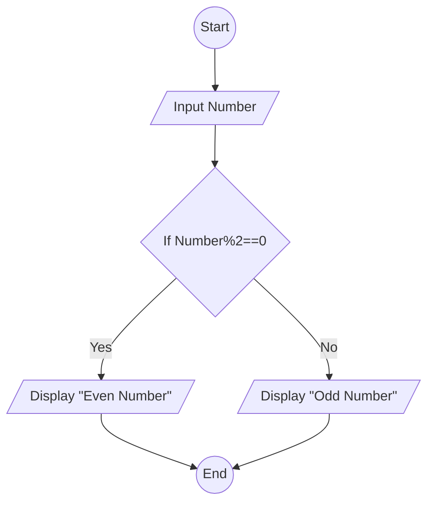

```mermaid
flowchart TD
    A((Start))-->B[/Input Number/]
    B[/Input Number/]-->C{If 
    Number%2==0}
    C{If Number%2==0} -->| Yes |D[/Display "Even Number"/]
    C{If Number%2==0} -->| No |E[/Display "Odd Number"/]
    D[/Display "Even Number"/]-->F((End))
    E[/Display "Odd Number"/]-->F((End))
```
